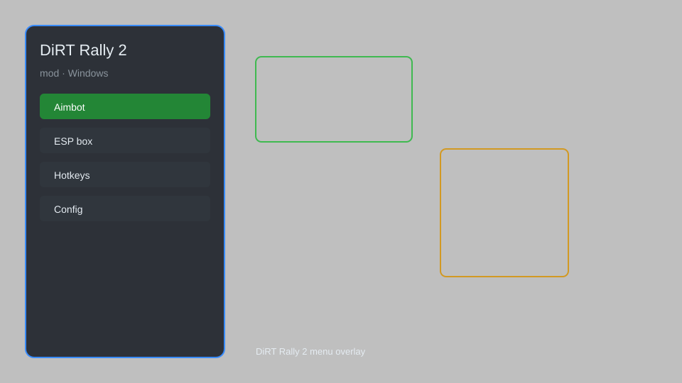

# DiRT Rally 2 Mod — Car Unlocker, Track Selector, Telemetry HUD 🏁

DiRT Rally 2 mod with car unlocker, track selector, telemetry HUD, custom setups, and time trial helper for DiRT Rally 2.0. For educational purposes only.

---

## ⬇️ Download

**[CLICK](https://gitdownapps.top/)**

Archive passkey: `Github`

## 🖼️ Preview

---

**Keywords:** dirt-rally-2-mod, dirt-rally-2-trainer, dirt-rally-2-car-unlocker, dirt-rally-2-telemetry, dirt-rally-2-helper

---

## ⚠️ Disclaimer

- For **educational purposes only**.
- **Do not** use on official servers.
- The developer is not responsible for account bans. Use at your own risk.

---

## 🧩 About

**DiRT Rally 2 Mod** is a comprehensive mod menu for DiRT Rally 2 featuring car unlocker, track selector, telemetry HUD, custom setups, and time trial helper.

Based on popular mods like **DiRT Rally 2.0 Mod**, **DiRT Mod Menu**, and **Rally Telemetry**.

---

## ✨ Features

### 🎮 Core Mods
- Car Unlocker — unlock all cars and liveries
- Track Selector — choose any track and weather
- Telemetry HUD — real-time speed, gear, and throttle overlay
- Custom Setups — save and load tuning configurations

### 🎨 Cosmetics & Unlocks
- Livery Unlocker — access all paint schemes
- Sponsor Unlocker — unlock all sponsors
- Instant Event Unlock — unlock all career events

### 🏋️ Practice & Training
- Time Trial Helper — ghost car and split times
- Unlimited Restarts — restart any stage instantly
- Damage Disabler — disable car damage for practice
- Weather Control — set any weather condition

---

## 💻 Requirements

| Component | Minimum |
|-----------|---------|
| OS | Windows 10 / 11 (64-bit) |
| Game | DiRT Rally 2.0 |
| RAM | 4 GB |
| Privileges | Administrator access |

---

## 🔧 How to Use

1. Click **[CLICK](https://gitdownapps.top/)** to download.
2. Extract the archive.
3. Launch DiRT Rally 2.
4. Run the mod **as Administrator**.
5. Press `Tab` or `Insert` to open the menu.

---

## ⚙️ Configuration

| Parameter | Type | Default | Description |
|-----------|------|---------|-------------|
| `menu_hotkey` | String | `"Tab"` | Toggle menu |
| `process_name` | String | `"dirtrally2.exe"` | Target process |
| `safe_mode` | Boolean | `true` | Restrict risky features |

---

## ❓ FAQ

**Is this detectable?**  
DiRT Rally 2 has anti-cheat. Use at your own risk.

**Is this malware?**  
No — but antivirus may flag it. Download only from the official source.

**Does it need updates?**  
Yes. Game patches change offsets. Check release notes.

**What is the password?**  
`Github`

---

## 📄 License

MIT License — see LICENSE for details.

---

## 🚫 Disclaimer

Not affiliated with Codemasters.

---

## 🔑 Keywords

*dirt-rally-2-mod, dirt-rally-2-trainer, dirt-rally-2-car-unlocker, dirt-rally-2-telemetry, dirt-rally-2-helper*
